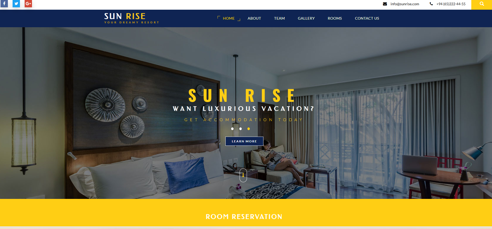
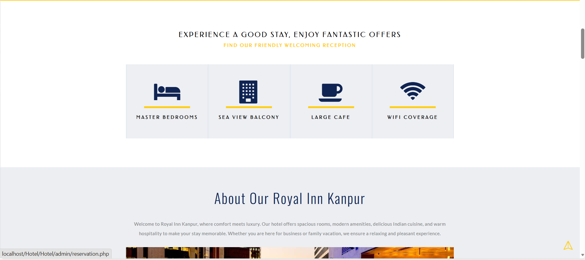
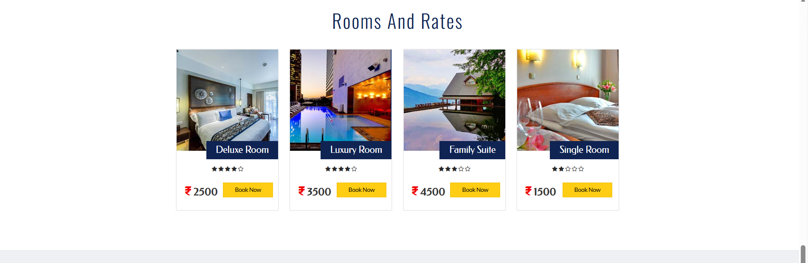
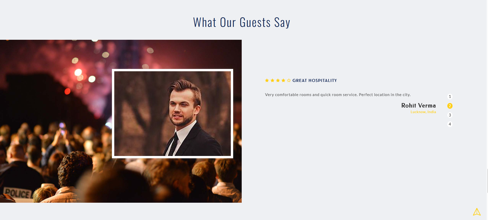
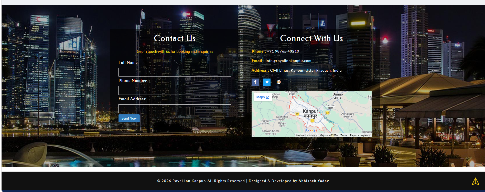

# Hotel Management System

A full-stack **Hotel Management System** built using **MERN Stack**.
This project helps users browse rooms, check room types, provide feedback, and contact the hotel management.

## Features

* Home page
* About section
* Our services
* Room types
* Rooms booking section
* Feedback form
* Contact page
* Team section

## Languages & Technologies Used

* **HTML5** – structure of web pages
* **CSS3** – styling and layout
* **JavaScript (ES6)** – frontend and backend logic
* **React.js** – frontend UI development
* **Node.js** – backend runtime
* **Express.js** – server-side framework
* **MongoDB** – database
* **Bootstrap** – responsive design and UI components

## Screenshots

### Home Page

### About Page

### Our Services

### Room Types

### Rooms

### Feedback

### My Team

### Contact

## Author

**Abhishek Yadav**
